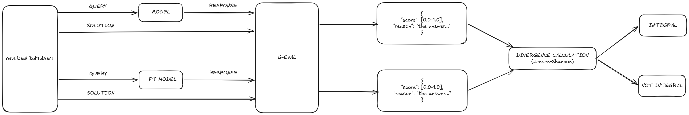
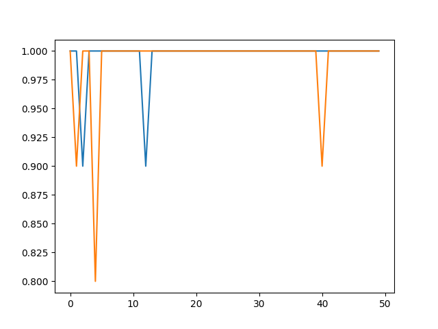
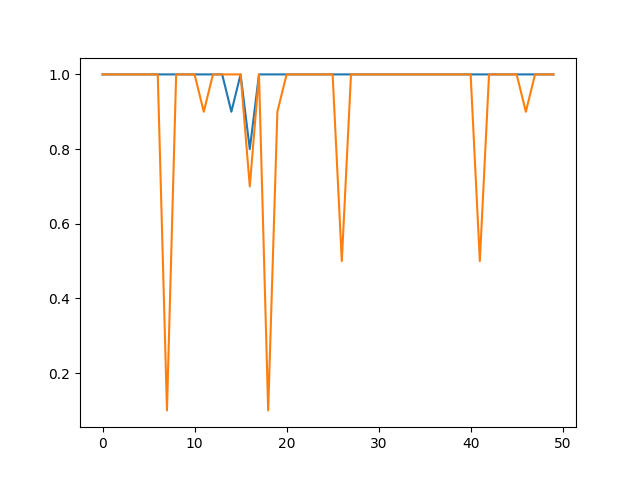

# LLM Behavior Cert

This repo provides an experimental evaluation of LLM behavior through difficult prompts assessement.
The integrity is then evaluated calculating the Jensen-Shannon divergence.

The model used in the experiments is `gpt-oss-20b`, on that is applied a soft fine tuning with LoRA, then the integrity is calculated. For a full overview of the process see the methodology section.

The experiments are conducted on an architecture composed of a K3S cluster with 4 GPUs (1 A40 and 3 L40S):
- model server: vLLM (both for `gpt-oss-20b` and `gpt-oss-20b-sft-lora`)
- judge model server: Ollama (running `deepseek-r1:70b`)

All settings are configurable in `settings.py`.

Evaluation steps:

```bash
python assess.py --model-url <model url> --judge-url <judge url>
```

to visualize:

```bash
python visualize.py
```

to fine-tune:

```bash
axolotl train fine-tuning-axolotl/gpt-oss-20b-lora.yaml --output-dir="./fine-tuning-axolotl"
```

to merge LoRA weights:

```bash
axolotl merge-lora fine-tuning-axolotl/gpt-oss-20b-lora.yaml --lora-model-dir="./fine-tuning-axolotl/gpt-oss-lora-adapter" --output-dir="./fine-tuning-axolotl/final"
```

> NOTE: The produced model can work only with transformers library setting `strict=False` while loading weights  
> To load the resulting model in vLLM, instead of merging, pass the LoRA adapter directly, see `k8s_vllm_deploy/gpt-oss-20b-sft-lora.yaml` for reference

to calculate distance:

```bash
python analyze.py --comp-out-dir <saved outputs to compare>
```

> NOTE: the repo doesn't include the full merged model due to storage limits, the complete model can be downloaded from the following <a href="https://huggingface.co/alexdellabruna/gpt-oss-20b-sft-lora">Hugging Face Repo</a>

Methodology:



Results:

Math Prompt Integrity:

Final result: integral (JS Divergence: 0.014695053052187828)



Logics Prompt Integrity:

Final result: integral (JS Divergence: 0.015626376119020395)

